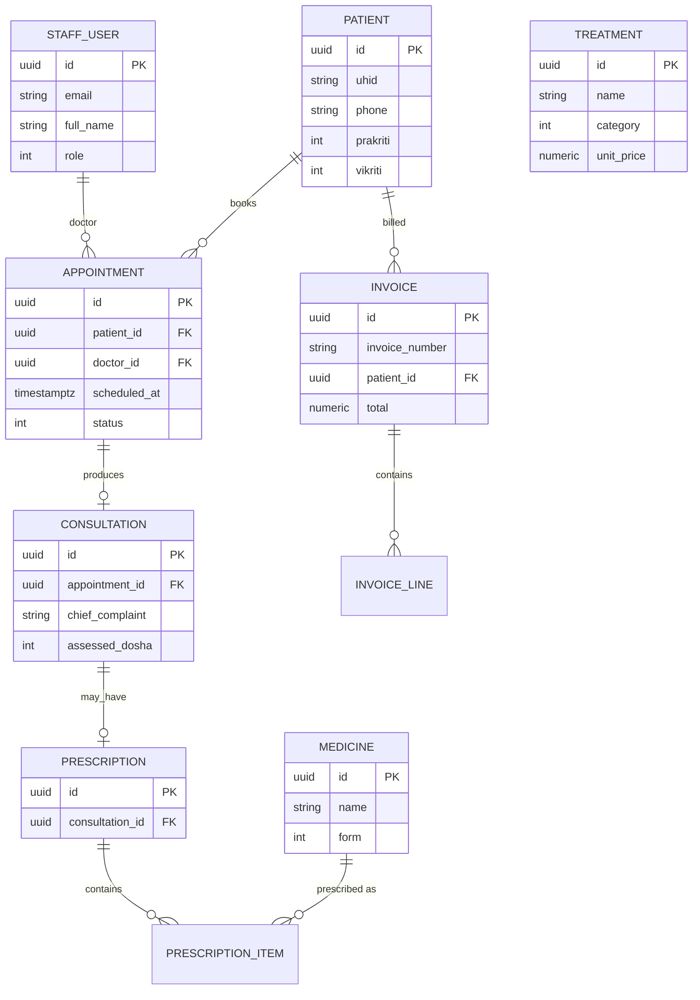

# Entity relationship overview

```mermaid
erDiagram
    STAFF_USER ||--o{ APPOINTMENT : "doctor"
    PATIENT ||--o{ APPOINTMENT : books
    APPOINTMENT ||--o| CONSULTATION : produces
    CONSULTATION ||--o| PRESCRIPTION : may_have
    PRESCRIPTION ||--o{ PRESCRIPTION_ITEM : contains
    MEDICINE ||--o{ PRESCRIPTION_ITEM : "prescribed as"
    PATIENT ||--o{ INVOICE : billed
    INVOICE ||--o{ INVOICE_LINE : contains

    STAFF_USER {
        uuid id PK
        string email
        string full_name
        int role
    }
    PATIENT {
        uuid id PK
        string uhid
        string phone
        int prakriti
        int vikriti
    }
    APPOINTMENT {
        uuid id PK
        uuid patient_id FK
        uuid doctor_id FK
        timestamptz scheduled_at
        int status
    }
    CONSULTATION {
        uuid id PK
        uuid appointment_id FK
        string chief_complaint
        int assessed_dosha
    }
    TREATMENT {
        uuid id PK
        string name
        int category
        numeric unit_price
    }
    MEDICINE {
        uuid id PK
        string name
        int form
    }
    PRESCRIPTION {
        uuid id PK
        uuid consultation_id FK
    }
    INVOICE {
        uuid id PK
        string invoice_number
        uuid patient_id FK
        numeric total
    }
```
