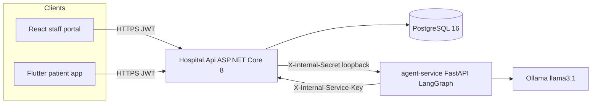
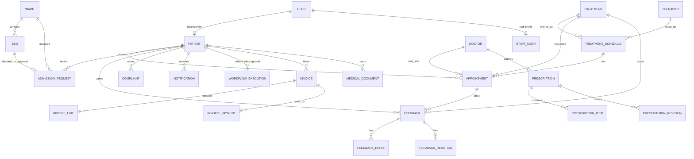
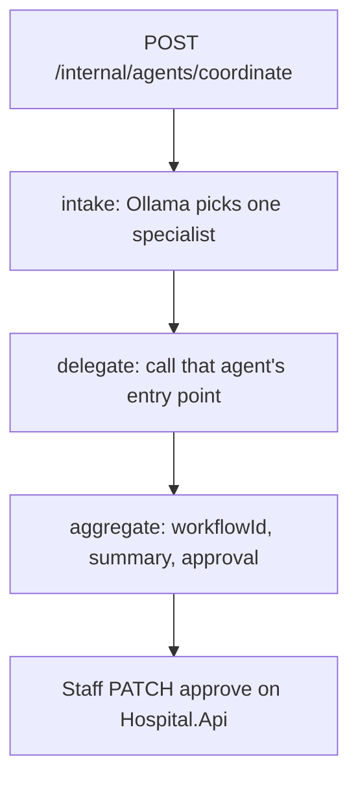
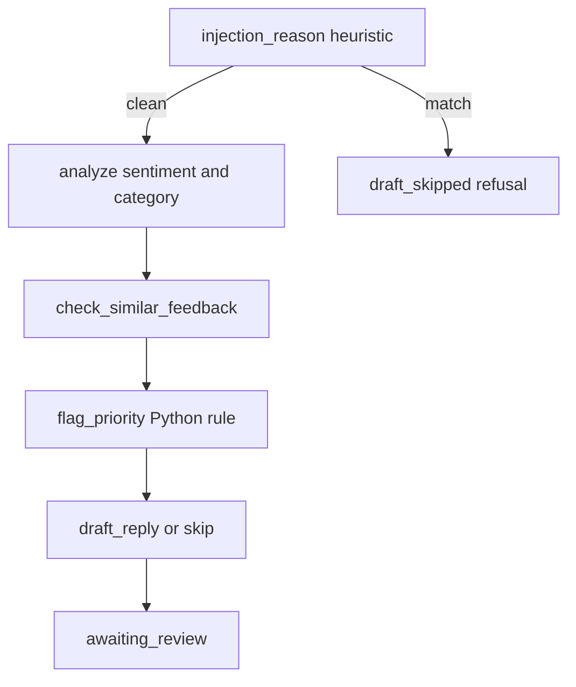
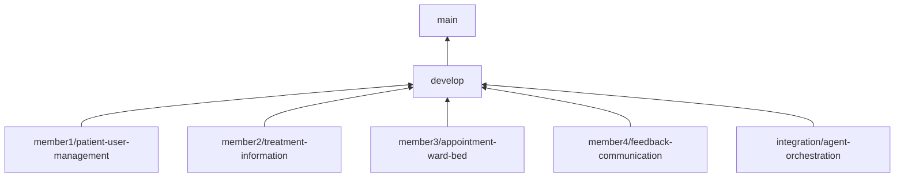

# Smart Ayurveda Hospital — submission report

Repository: https://github.com/IT24100539/Smart-Ayurveda-Hospital

This report is drawn from the repository on `main` at commit `8f8f266`. Where the repository does not record a name, a signature, a live URL, or a measured score, that gap is stated. It is not filled in.

---

# Group report

## 1. Project overview and scope

Smart Ayurveda Hospital is an operations platform for an Ayurveda hospital. It keeps one record of the patient, the treatment schedule, and the ward, and it keeps model output as a proposal until a vaidya or other staff member accepts it.

The business problem is operational, not a generic electronic medical record. Front desk, vaidyas, and patients otherwise split scheduling, bed allocation, and follow-up across separate conversations. A double-booked therapy slot, or an unreviewed model reply posted to a patient, is a clinical and operational failure.

In scope:

- Patient registration and identity, including UHID, prakriti (innate constitution), and vikriti (current imbalance).
- Treatment catalogue and weekly schedules with a capacity per slot (panchakarma and related therapies such as abhyanga).
- Appointment requests that reject a second patient when the last seat is taken.
- Ward occupancy and admission requests. Approving an admission assigns one free bed.
- Feedback, complaints, reactions, replies, and notifications. An agent reply stays a draft until staff post it.
- A coordinator that classifies an objective, delegates to one specialist, persists the run, and waits for staff to approve, reject, or revise.
- Later clinical modules present on `main`: doctor roster, prescriptions and formulations, invoices, medical documents, audit logs, and staff-account administration.

Out of the original member-4 sketch: a billing-only component was replaced by feedback and communication (ADR 0009, branch `member4/feedback-communication`). Invoice entities and a billing page were added later on `main` (`9e846a0`). The hospital is described in the member-4 note as a free provincial service; the invoice module exists in the code and should be treated as a later addition, not as the member-4 assignment.

Boundaries that the architecture does not cross:

- `backend/` (`Hospital.Api`) is the only public API. The staff portal and the patient app do not call anything else.
- `agent-service/` is internal. It binds to `127.0.0.1`. Browsers and the Flutter app never receive its URL.
- The agent is not the system of record. Clinical writes go through the API into PostgreSQL.

## 2. Requirements and user roles

| Role | Enum | What they do in this system |
| --- | --- | --- |
| Patient | `UserRole.Patient` | Register, sign in, browse treatments, request an appointment, submit feedback and complaints, read replies and notifications. |
| Front desk | `UserRole.FrontDeskStaff` (staff role `Receptionist` also exists on `StaffRole`) | Look up patients, manage appointments, see ward occupancy, handle billing pages, moderate feedback. |
| Doctor (vaidya) | `UserRole.Doctor` | Review the schedule, approve or reject agent plans, write prescriptions. |
| Therapist | `UserRole.Therapist` / `StaffRole.Therapist` | Listed on treatment schedules. Not a staff-portal login role in `web-staff/src/auth/roles.ts`. |
| Admin | `UserRole.Admin` | Staff accounts, treatments, wards, doctors, audit logs, feedback moderation, AI approvals. |

`StaffRole` also lists Pharmacist and Nurse. Those values are not routes in the React role map.

Functional requirements that the code enforces:

- Unauthenticated patient reads are rejected. Registration and login issue a JWT.
- Treatment catalogue reads are anonymous so a patient can browse before booking. Creating or editing treatments and schedules requires a staff role.
- Appointment creation is capacity-checked. The last seat is taken by exactly one of many parallel requests (`LOCK TABLE appointments` inside the booking transaction).
- An admission proposed by the scheduling agent is stored with `RequestedByAgent = true` and does not allocate a bed. Staff confirm the bed on the ward flow.
- Sentiment and category on feedback are filled after analysis, not at submit time. A drafted reply is not published by the agent.
- Production startup fails if a secret is missing or still a development placeholder (`ProductionSecretGuardTests`).

Seeded accounts, created when the user table is empty. Change them on any shared host:

- Admin: `admin@smartayurveda.local` / `ChangeMe!Admin1`
- Doctor: `doctor@smartayurveda.local` / `ChangeMe!Doctor1`
- Patient: `meera.nair@example.local` / `ChangeMe!Patient1`

## 3. Full-stack and agentic AI architecture



Clean Architecture (ADR 0006), four .NET projects:

| Project | Responsibility |
| --- | --- |
| `Hospital.Domain` | Entities, enums, domain exceptions. No project references. |
| `Hospital.Application` | Use cases, DTOs, FluentValidation, repository contracts. |
| `Hospital.Infrastructure` | EF Core, PostgreSQL, JWT, `IAgentClient`. |
| `Hospital.Api` | Controllers, middleware, composition root. The only process exposed to browsers and phones. |

The Python service is not a second public backend. New hospital capabilities are added Domain, then Application, then Infrastructure, then Api.

### Agentic AI

Two graphs live in `agent-service`.

The older router (`build_graph` in `app/graph/coordinator.py`) keyword-routes a prompt to `intake`, `appointment`, or `treatment`. The assignment entry point is the coordinator.

`POST /internal/agents/coordinate` runs a fixed LangGraph: **intake → delegate → aggregate**.

1. **Intake** asks Ollama (`/api/chat`, JSON schema) to pick exactly one specialist: `patient_info`, `treatment_info`, `scheduling_bed`, or `feedback_support`. The objective is sent as user content, with an instruction that it is data. A malformed label is retried once.
2. **Delegate** calls that specialist’s existing entry point. It does not reimplement the specialist.
3. **Aggregate** returns `workflowId`, `delegatedTo`, `summary`, `approvalStatus`, and `finalOutcome`.

| Specialist | Code | What it may do |
| --- | --- | --- |
| `patient_info` | `app/agents/patient_info_agent.py`, falling back to `intake_agent.py` | Answers prakriti, vikriti, and registration questions. Does not write the patient row. |
| `treatment_info` | `app/agents/treatment_info_agent.py` | Reads the catalogue through the internal API and returns a proposal. Does not publish a schedule change. |
| `scheduling_bed` | `app/agents/scheduling_bed_agent.py` | Files a pending admission (`RequestedByAgent`). Does not allocate the bed. |
| `feedback_support` | `app/agents/feedback_support_agent.py` | Sentiment, category, priority, similar-count, optional draft. Status is always `awaiting_review`. Never posts a reply. |

Staff read the run in the React portal and decide with `PATCH /api/agent-workflows/{id}/approve`.

Workflow snapshots are rows in `WorkflowExecutions`. The Python process keeps only in-flight state and persists through the API (ADR 0004). There is no Postgres driver in `agent-service`.

Feedback-support is a second fixed graph, not a model-chosen branch: **analyze → check_similar → flag → draft → awaiting_review**.

- `flag_priority` is plain Python. High when sentiment is Negative and category is StaffService, or when `similar_feedback_count >= 2`. A repeated category is High even if one comment is Neutral.
- Tools are a closed allow-list: `analyze_sentiment`, `categorize`, `get_feedback`, `check_similar_feedback`, `flag_priority`, `draft_reply`. Any other name raises `DisallowedToolError`. The model is not given tools.
- `injection_reason` runs before a comment is placed in a prompt. A match does not start the graph. The response is `draft_skipped=true` with `refusal_reason` set.
- An Ollama timeout becomes `OllamaCallError`. The graph still ends at `awaiting_review`. A failed draft leaves earlier analysis in place.

Model: local `llama3.1` via Ollama. No paid API key (ADR 0003, ADR 0008).

## 4. Database and ER diagram

PostgreSQL 16. Schema is EF Core migrations under `backend/src/Hospital.Infrastructure/Persistence/Migrations/`. The API applies pending migrations on startup.

The diagram in `docs/er-diagram/README.md` is an early sketch. It draws `CONSULTATION` and a doctor foreign key on `APPOINTMENT` in a shape the first migrations did not use. There is no `Consultation` entity. The implemented `Appointment` points at `Patient`, `Treatment`, an optional `TreatmentSchedule`, and an optional `Doctor`.

Implemented sets in `HospitalDbContext`:

`Users`, `StaffUsers`, `Patients`, `Appointments`, `Treatments`, `Therapists`, `TreatmentSchedules`, `Wards`, `Beds`, `AdmissionRequests`, `Feedbacks`, `FeedbackReactions`, `FeedbackReplies`, `Complaints`, `Notifications`, `PatientDeviceTokens`, `WorkflowExecutions`, `AuditLogs`, `DoctorRosters`, `Doctors`, `Prescriptions`, `PrescriptionItems`, `PrescriptionRevisions`, `Invoices`, `InvoiceLines`, `InvoicePayments`, `MedicalDocuments`.



`Patient` stores UHID (for example `SAH-2026-00001`), name, date of birth, gender, phone, prakriti, and vikriti (`DoshaType`). `WorkflowExecution` stores the agent name, objective, plan JSON, tool results, validation, `ApprovalStatus`, and `FinalOutcome`. The row id is the agent’s `workflow_id`.

Notable migrations called out by the member notes:

- `20260909170636_InitialIdentity` — users, staff, patients
- `20260911090858_AddAppointmentAndWard` — appointments, wards, beds, admissions
- `20260911163800_AddTreatmentAndSchedule` — treatments, schedules, therapists

## 5. API design

Base path `/api`. Local Swagger: `https://localhost:7443/swagger` and `http://localhost:5080/swagger`. Health: `GET /api/health` (anonymous). `GET /api/health/secure` requires Admin.

Writes use typed DTOs and FluentValidation.

| Area | Controller | Notes |
| --- | --- | --- |
| Auth | `AuthController` | `register`, `login`, password reset, `change-password` |
| Patients | `PatientsController`, `PatientSelfController` | Staff CRUD; patient registration summary and treatment plans |
| Treatments | `TreatmentsController` | Catalogue, slots, schedule CRUD, deactivate |
| Appointments | `AppointmentsController`, `AppointmentActionsController` | Book, list, reschedule, staff decision, patient cancel |
| Wards and beds | `WardsController`, `AdmissionsController` | Occupancy; patient requests admission; staff decision assigns a free bed |
| Feedback | `FeedbackController`, `RepliesController`, `ComplaintsController`, `NotificationsController` | Submit, moderate, reactions, replies, AI draft, complaints, device tokens |
| Agents | `AgentsController`, `AgentWorkflowsController`, `WorkflowExecutionsController` | `invoke`, `start`, ask-treatment, ask-patient, approve |
| Clinical (later) | `DoctorsController`, `PrescriptionsController`, `InvoicesController`, `MedicalDocumentsController` | Roster, formulations, billing, documents |
| Admin | `StaffManagementController`, `AuditLogsController` | Accounts, forced reset, audit |
| Internal | `InternalController`, `InternalPatientsController`, `InternalSchedulingController`, `InternalFeedbackController`, `InternalWorkflowExecutionsController` | Service key or internal auth policy only. Not for the browser or the phone. |

Internal calls use `X-Internal-Secret` (API → agent, `AgentService:SharedSecret` / `AGENT_SHARED_SECRET`) and `X-Internal-Service-Key` (agent → API, `INTERNAL_SERVICE_KEY`). In Development, `/api/internal/*` is served on plain HTTP `http://127.0.0.1:5080` and is not redirected to HTTPS.

## 6. React staff portal

`web-staff/`. Vite, React function components, Zustand for session state (ADR 0001), React Router. No second UI library was added for state.

The JWT and a user summary persist in `localStorage` through `authStore` (ADR 0010). `api/client.ts` attaches `Authorization: Bearer`. `ProtectedRoute` checks a valid JWT and `ROUTE_ROLES`.

| Route | Roles | Page |
| --- | --- | --- |
| `/login` | public | `LoginPage` |
| `/dashboard` | Admin, Doctor, FrontDeskStaff | `DashboardPage` |
| `/patients` | staff | `PatientsPage` |
| `/treatments` | Admin, Doctor | `TreatmentsPage` |
| `/appointments` | staff | `AppointmentsPage` |
| `/wards` | Admin, Doctor | `WardsPage` |
| `/feedback` | staff | `FeedbackPage` plus dashboard and complaint queue |
| `/ai-approvals` | staff | `AiApprovalsPage` |
| `/staff-management` | Admin | `StaffManagementPage` |
| `/doctors` | Admin | `DoctorsPage` |
| `/audit-logs` | Admin | `AuditLogsPage` |
| `/prescriptions` | Doctor | `PrescriptionsPage` |
| billing, documents, notifications, exports | as in `roles.ts` | matching pages |

Dev server: `http://localhost:5173`. `VITE_API_BASE_URL` defaults to `http://localhost:5080/api`. A wireframe is `docs/wireframes/staff-portal.html`.

Visual system: Ayurveda light and dark tokens, fonts bundled locally (Source Sans 3, Source Serif 4, Noto Sans Sinhala, SIL OFL). Photographs already in the tree have unverified provenance (`CREDITS.md`).

## 7. Flutter patient app

`mobile-patient/`. Flutter 3.41, Material 3, Riverpod (ADR 0002), GoRouter. `ProviderScope` in `main.dart`. `authControllerProvider` drives redirects.

`API_BASE_URL` is a compile-time `--dart-define`. If it is empty:

- Android: `http://10.0.2.2:5080/api` (emulator alias for the host)
- Web, desktop, iOS simulator: `http://localhost:5080/api`

A physical phone has no loopback alias. Pass the machine’s LAN address, for example `http://192.168.1.100:5080/api`. The value must include `/api` and must not have a trailing slash.

Screens include splash, login, forgot and reset password, onboarding, home, treatments and treatment detail, appointments, ward availability, doctors, feedback hub (submit feedback, my feedback, public feed, complaints, notifications), health hub, records and document viewer, profile, FAQ, contact, and Charaka chat.

Release networking: `android/app/src/main/AndroidManifest.xml` has `INTERNET`. Cleartext HTTP is permitted only for `10.0.2.2`, `10.0.3.2`, `localhost`, and `127.0.0.1`, so a release APK can reach a local API. Any other host must be HTTPS.

## 8. Technical report

| Layer | Choice | Why it is in the repo |
| --- | --- | --- |
| API | ASP.NET Core 8, Clean Architecture | One public API. Domain rules stay out of HTTP and SQL. ADR 0006. |
| Validation | FluentValidation on write endpoints | Reject bad input before the domain. |
| Data | PostgreSQL 16, EF Core migrations | Relational hospital data and durable workflow JSON. ADR 0004, ADR 0008. |
| Staff UI | React, Vite, Zustand | Small session store. ADR 0001, ADR 0010. |
| Patient UI | Flutter, Riverpod | Android patient app. API base URL fixed at build time. ADR 0002. |
| Agents | FastAPI, LangGraph, Ollama `llama3.1` | Local model, no paid key. Graph is plan, then delegate, then human approval. ADR 0003. |
| Hosts (intended) | Render, Neon, Vercel | Free tier for API, Postgres, and staff portal. The agent stays off those hosts. ADR 0007 and `docs/deployment-*.md`. |

ADR 0005 itself is still status **Proposed (TBD)** and says the vendor choice would be finalized later. The deployment guides and `render.yaml` / `web-staff/vercel.json` are the later, more specific choice: Render for the API, Neon for Postgres, Vercel for the staff portal. Those guides also say nothing is deployed yet.

Branching (ADR 0009): `main` ← `develop` ← `memberN/...`, plus `integration/agent-orchestration`. CI is `.github/workflows/ci.yml` (backend tests against Postgres 16, pytest, `npm` lint/test/build, `flutter analyze` and `flutter test`).

Local integration history on this clone: `main` is `8f8f266`. `develop` is behind `origin/develop` by 8 commits. Local `member1`, `member2`, and `member3` branches still point at the initial commit `0858e9b`. Their work is on `main` through GitHub pull requests, not on those stale local branch tips. `member4/feedback-communication` is `04c8990`.

## 9. Software testing report

CI runs four jobs on pull requests and pushes to `main` and `develop`. This report session did not re-execute the full suite. The inventory below is the suite in the tree.

**Backend unit tests** (`backend/tests/Hospital.UnitTests/`): auth and validators, patients, treatments, appointments, wards, feedback, replies, reactions, complaints, invoices, prescriptions, staff management, device tokens, audit sanitizer, actor context.

**Backend integration tests** (`backend/tests/Hospital.IntegrationTests/`), Postgres via `ConnectionStrings__IntegrationTests`: health and auth, auth protection, password reset, appointments and wards, internal scheduling, feedback communication, internal feedback, complaint escalation, doctors, prescriptions, invoices, medical documents, staff management, audit log API, workflow execution, production secret guard, problem-detail sanitizer, clinical audit interceptor. Parallelization is disabled and database reset is serialized (`CollectionBehavior`, advisory lock) after overlapping migrations recreated `treatment_schedules`.

**Agent tests** (`agent-service/tests/`): coordinator routing with a mocked Ollama, feedback-support graph (tools, injection, Ollama failure), treatment-info, patient-info, scheduling contracts and route, state store, workflow persistence, internal secrets, tool allow-list.

**React** (`web-staff`, Vitest): login, patients, treatments, wards, dashboard, feedback dashboard, complaint queue, AI approvals, notifications, doctors, prescriptions, billing, documents, exports, staff management, audit logs, routes, theme contrast.

**Flutter** (`mobile-patient/test/`, 33 test files): router, login, password reset, treatments, appointments, feedback widgets, notifications, doctors, home, onboarding, health hub, records, profile, FAQ, contact, Charaka chat, theme.

**Commands**

```text
dotnet test backend/Hospital.sln
cd agent-service && pytest tests/ -v
npm test --prefix web-staff
cd mobile-patient && flutter test
```

What the tests are designed to lock:

- One booking wins the last seat; the others conflict.
- Patient endpoints reject missing or wrong roles.
- Agent drafts and admissions do not become published clinical facts by themselves.
- Production refuses placeholder secrets.
- Feedback tools outside the allow-list throw, and an injection heuristic refuses the comment before the model runs.

## 10. Agentic AI evaluation report

Evaluation in this repository is behavioural, with the model mocked, plus one live latency probe that did not reach Ollama. There is no labelled accuracy set, and no precision, recall, or human rating table for `llama3.1` outputs. Those numbers are not invented here.

| Check | Evidence | Result recorded in the repo |
| --- | --- | --- |
| Intake delegates a scheduling objective to `scheduling_bed` and does not call feedback | `agent-service/tests/test_coordinator.py` | Asserts `delegated_to`, shared `workflow_id`, `approval_status=pending`, `final_outcome=awaiting_approval` |
| Intake delegates a feedback objective to `feedback_support` | same file | Scheduling mock is not awaited |
| Malformed specialist JSON is retried once, then fails closed | `coordinator.py` `_classify` | Raises if the second reply is still not the enum |
| Feedback tools are a closed set | `test_feedback_support.py`, `ALLOWED_TOOLS` | `DisallowedToolError` for any other name |
| Prompt-injection heuristic | `injection_reason` before the graph | Graph not started; `draft_skipped` and `refusal_reason`; sentiment, category, and priority unset |
| Ollama failure does not publish a reply | feedback agent | Draft skipped; earlier analysis kept; status stays `awaiting_review` |
| Priority rule | `flag_priority` in `app/tools/tools.py` | High for Negative+StaffService, or similar count ≥ 2. No model call |
| Scheduling agent does not allocate a bed | member 3 note and `AdmissionRequest.RequestedByAgent` | Pending admission; staff `PATCH` assigns the bed |
| Human gate | `PATCH /api/agent-workflows/{id}/approve` and reply decision endpoint | Staff approve, reject, or edit. The agent status for feedback is `awaiting_review` |
| Live generation quality | `docs/performance-report.md` | Not measured. Ten calls returned HTTP 500 because Ollama at `127.0.0.1:11434` was down |

Design limits that evaluation should keep in view:

- Sentiment from a small local model is treated as noisy. That is why a repeated category is High even when one comment is Neutral (member 4 note).
- Read-only specialists (`patient_info`, `treatment_info`) return `approval_status=None` and `final_outcome` of `success` or `safe_failure`. They still must not write clinical rows.
- Keyword routing in `route_node` still exists beside the Ollama classifier. The coordinate path uses the classifier, not the keyword router.
- A demo needs Ollama running. The failure path alone took about 7–11 seconds (section 11).

## 11. Performance report

Measured on 25 September 2026. k6 2.2.0. API `http://127.0.0.1:5000`. Agent `http://127.0.0.1:8100`. Scripts in `perf/k6/`. Full note: `docs/performance-report.md`.

**GET /api/treatments**, 50 virtual users, 30 seconds. Pass bar: p95 under 500 ms and HTTP error rate 0%.

| Metric | Result |
| --- | --- |
| Requests | 2064 |
| Throughput | 59.6 req/s |
| Median | 115 ms |
| p90 | 548 ms |
| p95 | 2.48 s |
| Average | 715 ms |
| Max | 19.0 s |
| HTTP errors | 1.16% (24 / 2064) |

The pass bar was not met. A repeat after the booking race was worse: 929 requests, p95 15.8 s, 4.41% HTTP 500. The median stayed under 100 ms, so the failure is the tail under 50 concurrent readers.

**Double-booking**, 20 parallel `POST /api/appointments` on the last seat of seeded Abhyanga Monday `09:00-10:00`.

| Outcome | Count |
| --- | --- |
| Created (201) | 1 |
| Conflict (409) | 19 |

The transaction guard held. k6 counts those 409s inside `http_req_failed`; that counter is the expected rejection.

**POST /internal/agents/scheduling-bed**, 10 sequential calls, preferred date `2026-10-20`. Every call returned HTTP 500. Ollama was not listening. These times are the failure path.

| Metric | Milliseconds |
| --- | --- |
| Min | 7105 |
| Average | 9427 |
| Max | 10808 |

For a live demo, leave at least 11 seconds after starting a scheduling-bed run before expecting a result on that machine. A successful CPU generation would be slower than this failure path.

```text
k6 run perf/k6/treatments.js -e BASE_URL=http://127.0.0.1:5000
k6 run perf/k6/double-booking.js -e BASE_URL=http://127.0.0.1:5000
k6 run perf/k6/scheduling-agent.js -e AGENT_URL=http://127.0.0.1:8100
```

The dev script in the README uses API ports 5080 and 7443, and agent port 8100 in one place and 8001 in another (`AGENT_PORT` / `AgentService:BaseUrl`). Use the port the process actually bound before comparing numbers.

## 12. Deployment report

Cloud hosting is specified and not live. `docs/deployment-backend.md` says “Nothing is deployed yet.” The README lists the Render host, the Vercel host, and Swagger on that host as placeholders.

| Piece | Intended host | Evidence in the repo | Live URL |
| --- | --- | --- | --- |
| API | Render free, Docker, `backend/Dockerfile` | `render.yaml` health check `/api/health` | Not assigned |
| PostgreSQL | Neon free, pooled connection string | `docs/deployment-backend.md` | Not a browser URL. No Neon endpoint is stored in git |
| Staff portal | Vercel, root `web-staff/` | `web-staff/vercel.json` | Not assigned |
| Patient app | APK, not a web host | `docs/deployment-mobile-patient.md` | Built locally. See the APK section |
| Agent + Ollama | The demo machine only | `docs/deployment-agent-service.md`, ADR 0007 | `http://127.0.0.1:8001` when `python run.py` uses the default port |

`docker-compose.yml` publishes Postgres 16 (`sah-postgres`, database `ayurveda_hospital`, port 5432) and Ollama (`sah-ollama`, port 11434). It does not publish the agent.

On startup the API applies EF migrations and seeds accounts when the user table is empty. Render sets `PORT`, so TLS terminates at the proxy and a Kestrel certificate is not required. A host that terminates TLS itself must set `Kestrel__Certificates__Default__Path` and `Kestrel__Certificates__Default__Password`.

A tunnel (ngrok) is documented only as a short fallback if a cloud API must reach an agent on a laptop. The planned demo runs the whole stack on one machine. Stop the tunnel when the demo ends.

## 13. Architecture decision records

| ADR | Status | Date | Decision |
| --- | --- | --- | --- |
| 0001 | Accepted | 2026-09-10 | Zustand for staff session state. Not Redux, not a second store library. |
| 0002 | Accepted | 2026-09-10 | Riverpod for the patient app. Not Bloc, not Provider beside it. |
| 0003 | Accepted | 2026-09-10 | LangGraph plus Ollama `llama3.1`. No paid cloud model without a new ADR. |
| 0004 | Accepted | 2026-09-10 | Workflow state in PostgreSQL through the API. Python is not the system of record and has no Postgres driver. |
| 0005 | Proposed (TBD) | 2026-09-10 | Vendor list only. Deployment guides later name Render, Neon, and Vercel. |
| 0006 | Accepted | 2026-09-09 | Four-project Clean Architecture. `Hospital.Api` is the only public process. |
| 0007 | Accepted | 2026-09-09 | Agent binds to `127.0.0.1`. Callers are the API, with `X-Internal-Secret`. |
| 0008 | Accepted | 2026-09-09 | Compose runs PostgreSQL 16 and Ollama for local development. |
| 0009 | Accepted | 2026-09-09 | `main` ← `develop` ← member branches. CI required to merge. |
| 0010 | Accepted | 2026-09-09 | Staff JWT in `localStorage` for this project. Production should move to an httpOnly cookie. |

Files: `docs/adr/0001` through `docs/adr/0010`, plus `docs/adr/0000-template.md`.

## 14. Security considerations

- One public API. The agent port is not in Compose’s published ports. Staff and patients never receive the agent URL (ADR 0007).
- JWT bearer authentication and role policies on controllers. Admin-only: staff management, audit logs, doctor administration, secure health.
- Two internal secrets. `X-Internal-Secret` authenticates the API to the agent. `X-Internal-Service-Key` authenticates the agent to internal API routes. An empty key is rejected.
- Secrets are not committed as real values. `appsettings.json` holds placeholders. Development uses `dotnet user-secrets`. Production fails startup on a missing or placeholder secret.
- Password reset, lockout, token revocation, and forced password change are in the phase-2 and phase-9 commits (`f64b479`, `9529ea6`, `5dd5fee`).
- Audit log API and a clinical audit interceptor. Audit detail sanitizer tests exist.
- Problem details returned to clients are sanitized (`ProblemDetailSanitizerTests`).
- CORS in production is an explicit `https` origin list (`AllowedOrigins`). No localhost on that list.
- HTTPS and HSTS when the process terminates TLS. When `PORT` is set, the platform terminates TLS.
- Feedback comments are checked for instruction-override phrasing before they enter a prompt, and the model is not offered tools.
- Staff JWT in `localStorage` is readable by any script that runs in the portal. XSS can steal it until expiry (ADR 0010). This is an accepted student trade-off, not a production pattern.
- Seed passwords are known and must be changed on any shared host.
- Release APK cleartext is limited to emulator and loopback names so the local HTTP API works. Do not point a release build at a public HTTP API.
- Photographs under the image folders have unverified provenance (`CREDITS.md`). Fonts are SIL OFL and bundled, not loaded from a CDN.

## 15. Diagrams

Architecture and the implemented ER diagram are in sections 3 and 4.

Coordinator:



Feedback-support:



Branch model (ADR 0009):



## 16. References

Project records:

- `README.md`, `CREDITS.md`, `docs/performance-report.md`
- `docs/adr/0001`–`0010`
- `docs/deployment-backend.md`, `docs/deployment-web-staff.md`, `docs/deployment-agent-service.md`, `docs/deployment-mobile-patient.md`
- `docs/individual/member1-contribution.md` through `member4-contribution.md`
- `docs/er-diagram/README.md` (early sketch; section 4 is the implemented model)
- `render.yaml`, `docker-compose.yml`, `.github/workflows/ci.yml`

External (product documentation, not papers):

- ASP.NET Core: https://learn.microsoft.com/aspnet/core
- Entity Framework Core: https://learn.microsoft.com/ef/core
- PostgreSQL 16: https://www.postgresql.org/docs/16/
- React: https://react.dev/
- Zustand: https://github.com/pmndrs/zustand
- Flutter: https://docs.flutter.dev/
- Riverpod: https://riverpod.dev/
- LangGraph: https://langchain-ai.github.io/langgraph/
- Ollama: https://ollama.com/
- k6: https://k6.io/docs/
- Render, Neon, Vercel free-tier docs for the intended hosts

## 17. Consolidated group AI usage declaration

Each member’s use of AI tools is supposed to be logged in `docs/individual/memberN-contribution.md`. The repository does not contain a single merged log.

| Member | Log in the repository |
| --- | --- |
| 1 Patient and user management | No AI usage table. Contribution file has an owned-component list and a short reflection. |
| 2 Treatment information | No AI usage table. Same shape as member 1. |
| 3 Appointments, wards, and beds | No AI usage table. Same shape as member 1. |
| 4 Feedback and communication | One row, 2026-09-25, Cursor. Used to compare the Flutter feedback form with `feedback_widgets_test.dart` and to fill the contribution record from files already on the branch. The five-node graph, draft-until-staff-post rule, and injection guard were already in `feedback_support_agent.py`. No earlier tool sessions were invented. |

Git author names on this clone, not mapped to member numbers by any file in the repo: `IT24100539` (18 commits), `Dilum-Alahakoon` (17), `Wijesiri S.P.R.H` (4), and a placeholder `Your Name` (40). Do not treat that placeholder as a person.

Declaration the group can sign after each person has checked their own section:

We used AI tools only as recorded in the individual logs. Where a log is empty, that member must add the true record before submission. Every member can explain, test, and modify the code submitted under their name. AI output was not copied in as an unreviewed clinical or security control.

Signatures: not present in the repository. Each student signs their own section below.

---

# Individual reports

The four seats are the ones in ADR 0009. The repository does not record a student name, index number, or signature on any individual file. Sections below use the member number and the owned component. Signature lines are blank on purpose.

## Member 1 — Patient and user management

**Branch:** `member1/patient-user-management`

**Contribution statement.** Patient registration, login, and the patient record (UHID, prakriti, vikriti). Staff search and edit patients in the React portal. Patients register and sign in from the Flutter app.

**Owned component and technical work.**

- API: `AuthController`, `PatientsController`, `AuthService`, `PatientService`, `RegisterRequestValidator`, `PatientRequestValidators`
- PostgreSQL: migration `20260909170636_InitialIdentity` (`Users`, `StaffUsers`, `Patients`)
- React: `web-staff/src/pages/PatientsPage.tsx`, `web-staff/src/store/authStore.ts`
- Flutter: `mobile-patient/lib/src/features/auth/`
- Agent: `agent-service/app/agents/intake_agent.py`, routed as `patient_info` from `app/graph/coordinator.py`
- Tests that cover this area: `AuthServiceTests`, `AuthValidatorsTests`, `PatientServiceTests`, `HealthAndAuthTests`, `AuthProtectionTests`, `PasswordResetTests`, Flutter `login_screen_test.dart`, `auth_form_rules_test.dart`, `password_reset_screens_test.dart`

The patient API rejects unauthenticated reads. Registration and login issue a JWT. The intake agent answers prakriti, vikriti, and registration questions and does not write the patient row.

**Key commit, pull-request, and test evidence.** The local branch tip in this clone is still `0858e9b` (“Initial commit: shared hospital foundation”). Integrated history on `main` includes `5e46d3b` (“fix(auth/patient): link patient record on registration and show contrast-safe unlinked state”) and `f64b479` (lockout, reset-password flow, audit logging). Pull-request numbers in `git log` for this seat specifically are not labelled `member1` the way member 2’s are. CI jobs `backend` and `flutter-analyze` are the test gate.

**Challenges and learning.** The contribution file does not record a challenge list. Related code on `main` shows a real defect that had to be fixed: registration could leave a user with no linked patient row (`5e46d3b`, branch note `phase/1-verify-and-fix`). Password reset and lockout arrived in the security-hardening commits, which sit outside the original member-1 file list.

**Individual AI usage log.** Not in the repository. The member must add dates, tools, tasks, what they kept, and what they rejected before this section is submitted as theirs.

**AI reflection (draft from the repository, about one page).** This draft is not a signed student statement. Member 1 should rewrite it in their own words.

The patient seat is the identity boundary for the rest of the hospital. A treatment booking, an admission, and a feedback row all point at `Patient`. If registration creates a login and forgets the patient row, every later screen looks empty and the agent has no prakriti or vikriti to read. The fix on `main` is to link that record at registration and to show an explicit unlinked state instead of a blank clinical page.

I would keep the split the code already has. `AuthController` proves who is calling. `PatientService` owns UHID, prakriti, and vikriti. The Flutter auth feature only stores the token and calls `Hospital.Api`. It does not embed dosha rules. The intake agent is allowed to explain those fields and is not allowed to insert the row. That is the same rule as the other specialists: the model proposes, the API writes.

AI tools are useful here for mapping validators to screens, and they are a poor source of the password policy. The policy lives in API configuration (`PASSWORD_MIN_LENGTH` and the matching Flutter `AppConfig` flags). A generated form that accepts a shorter password than the API will fail only at submit time. I would test the form rules against the same numbers the API uses, which is what `auth_form_rules_test.dart` is for.

What I would change next is the staff token storage, even though ADR 0010 put the JWT in `localStorage`. The patient app can hold a token in a more appropriate store on the device. The staff portal’s choice is documented as temporary. I would not ask a model to “make login secure” without reading that ADR, because the generated answer is usually an httpOnly cookie sketch that this CORS setup does not implement.

**Signed declaration.** I can explain, test, and modify the patient and auth code submitted under my name. My AI usage log above is complete. Unsigned until the student signs.

Name: ____________________ Index: ____________________ Signature: ____________________ Date: ____________________

## Member 2 — Treatment information

**Branch:** `member2/treatment-information`

**Contribution statement.** The treatment catalogue and weekly schedules, including capacity per slot. Patients browse treatments. Staff edit the catalogue and the schedule.

**Owned component and technical work.**

- API: `TreatmentsController`, `TreatmentService`, `TreatmentRequestValidators`
- PostgreSQL: migration `20260911163800_AddTreatmentAndSchedule` (`Treatments`, `TreatmentSchedules`, `Therapists`)
- React: `web-staff/src/pages/TreatmentsPage.tsx`, `web-staff/src/components/treatments/TreatmentsView.tsx`
- Flutter: `mobile-patient/lib/src/features/treatments/`
- Agent: `agent-service/app/agents/treatment_info_agent.py`
- Tests: `TreatmentServiceTests`, `test_treatment_info_agent.py`, `TreatmentsView.test.tsx`, `treatments_screen_test.dart`, `treatments_logic_test.dart`

Catalogue reads are anonymous. Creating and editing treatments and schedules requires a staff role. The treatment-info agent reads the catalogue through the internal API and returns a proposal. It does not publish a schedule change. Coordinator outcome is `success`, or `safe_failure` when the agent refuses. `approval_status` is null for this read-only path.

**Key commit, pull-request, and test evidence.**

| Hash | Subject |
| --- | --- |
| `3caf537` | Merge pull request #16 from `IT24100539/member2/treatment-information` |
| `3d6d2ed` | Merge pull request #10 from `IT24100539/member2/treatment-information` |
| `a4d4902` | Merge pull request #11 from `IT24100539/member2/treatment-information` |
| `bfd3255` | Add treatment-info agent with LangGraph and Ollama |
| `1911105` | Resolve conflicts, fix enum mappings, and implement the Ayurvedic info agent |
| `ab9d6fb` | Add treatments browsing screen to mobile-patient |
| `3c07c98` | Fix duplicate `treatment_schedules` creation across migrations |
| `903e05f` | Serialize integration-test database reset |

The local branch tip is still `0858e9b`. The table is the history that actually merged.

**Challenges and learning.** The contribution file does not list challenges. The commit subjects do: enum mappings drifted across branches, and overlapping test processes recreated `treatment_schedules`. The fix was an advisory lock and disabled test parallelization. A comment in `TreatmentService` still notes that remaining-slot counts waited on Member 3’s appointment table.

**Individual AI usage log.** Not in the repository. Add it before submission.

**AI reflection (draft from the repository, about one page).** Rewrite in the student’s own words before signing.

The treatment catalogue is the public face of the hospital and the input to booking. Anonymous `GET` is deliberate: a patient should see abhyanga or shirodhara, the weekday, and the capacity before they have an account. The write side is staff-only. An agent that can “update the schedule” from a sentence would bypass that. `treatment_info_agent` answers from the internal API and stops.

The hard bug was not the model. Two branches both created `treatment_schedules`, and integration tests reset the database in parallel, so the table appeared twice or not at all. Serializing `ResetDatabaseAsync` is dull work, and it is the reason the suite can be trusted. I would not accept an AI patch that “fixes the migration” by editing the model snapshot without reading both migrations.

I would also keep capacity as a column on the schedule and the appointment count as Member 3’s responsibility. A generated helper that subtracts appointments inside the treatment service will race the booking lock. The lock that passed the 20-way k6 test lives on the appointment insert, not in the catalogue.

The agent tests mock Ollama. That proves routing and refusal. It does not prove that `llama3.1` names the right therapy. I would keep a short list of real catalogue questions for the demo, run with Ollama up, and treat a wrong fee or a wrong weekday as a failed demo even if pytest is green.

**Signed declaration.** I can explain, test, and modify the treatment catalogue, schedules, and treatment-info agent submitted under my name. My AI usage log above is complete. Unsigned until the student signs.

Name: ____________________ Index: ____________________ Signature: ____________________ Date: ____________________

## Member 3 — Appointments, wards, and beds

**Branch:** `member3/appointment-ward-bed`

**Contribution statement.** Appointment requests, slot capacity, ward occupancy, and admission requests. Approving an admission assigns one free bed. A second booking is rejected when the last seat is taken.

**Owned component and technical work.**

- API: `AppointmentsController`, `AppointmentActionsController`, `WardsController`, `AdmissionsController`, `AppointmentService`, `WardService`
- PostgreSQL: migration `20260911090858_AddAppointmentAndWard` (`Appointments`, `Wards`, `Beds`, `AdmissionRequests`)
- React: `web-staff/src/pages/AppointmentsPage.tsx`, `web-staff/src/pages/WardsPage.tsx`
- Flutter: `mobile-patient/lib/src/features/appointments/`, `mobile-patient/lib/src/features/wards/`
- Agent: `agent-service/app/agents/scheduling_bed_agent.py`
- Internal routes: `InternalSchedulingController` (`InternalServiceOnly`)
- Tests: `AppointmentServiceTests`, `WardServiceTests`, `AppointmentAndWardIntegrationTests`, `InternalSchedulingTests`, `test_scheduling_bed_agent.py`, `test_scheduling_contracts.py`, `test_scheduling_route.py`, `appointment_screens_test.dart`, `WardsPage.test.tsx`
- Performance: `perf/k6/double-booking.js` — 1 created, 19 conflicts

Patients request a visit. Staff approve it. Ward staff approve an admission only when a bed is free. The scheduling agent files a pending admission and does not allocate the bed.

**Key commit, pull-request, and test evidence.** No merge commit in the sampled `git log` is labelled `member3/appointment-ward-bed`. The behaviour is on `main` in the controllers and tests above, and in the k6 result of 25 September 2026. Integration of the agent path is pull request #13, commit `22d345c` (“agent coordinator, workflow persistence, unified AI approvals”), merge `434fdfb`. The local member-3 branch tip is still `0858e9b`.

**Challenges and learning.** Not written in the contribution file. The performance report is the evidence: the capacity lock holds at 20-way concurrency, which is a stronger check than a two-request unit test. The catalogue read path does not meet its latency bar; that is a separate problem from correctness of the last seat.

**Individual AI usage log.** Not in the repository. Add it before submission.

**AI reflection (draft from the repository, about one page).** Rewrite in the student’s own words before signing.

A double-booked panchakarma slot is the failure this seat exists to prevent. The rule is small: one schedule has N seats, N inserts may commit, the next must be a 409. Implementing that with a read of “current count” followed by an insert is wrong under concurrency. The code takes a lock on `appointments` inside the transaction. k6 then fired 20 requests at one remaining seat and got one 201 and nineteen 409s. I would keep that test. A unit test with two sequential calls does not show the race.

The bed rule is the same idea with a human in the middle. The scheduling agent may create an `AdmissionRequest` with `RequestedByAgent` set. It may not set `BedId`. Staff approval does that, and only when a bed in the ward is free. If a model is allowed to mark the bed occupied, a crashed or repeated run can fill the ward on paper.

I would not use AI to “optimize” the lock into a shorter query without re-running `double-booking.js`. I would use it to list the states of `AppointmentStatus` and `AdmissionRequestStatus` and to check that the Flutter screens show Pending rather than a fake confirmed seat.

The agent latency probe is a warning for the demo. Ten scheduling calls failed in 7–11 seconds because Ollama was down. A viva that starts the agent and expects a bed plan in two seconds will look like a bug. Start Ollama first, and say the plan is a proposal.

**Signed declaration.** I can explain, test, and modify the appointment, ward, bed, and scheduling-agent code submitted under my name. My AI usage log above is complete. Unsigned until the student signs.

Name: ____________________ Index: ____________________ Signature: ____________________ Date: ____________________

## Member 4 — Feedback and communication

**Branch:** `member4/feedback-communication` (tip `04c8990`, “fix(ci): register feedback-support and sync the contracts CI could not build”)

**Contribution statement.** Patient and staff communication after a visit: feedback on an appointment or treatment, complaints, replies, reactions, and notifications. The public API owns the write path. The agent returns a draft and an analysis. Staff review the draft before it is posted.

**Owned component and technical work.**

- API: `FeedbackController`, `RepliesController`, `ComplaintsController`, `NotificationsController`, `InternalFeedbackController`, feedback services
- Flutter: `mobile-patient/lib/src/features/feedback/`, tests `feedback_widgets_test.dart`, `communication_providers_test.dart`
- React: `FeedbackPage`, `FeedbackDashboardPage`, `ComplaintQueuePage`
- Agent: `app/agents/feedback_support_agent.py`, tools in `app/tools/tools.py`
- Tests: `FeedbackServiceTests`, `ReplyServiceTests`, `ReactionServiceTests`, `ComplaintServiceTests`, `InternalFeedbackServiceTests`, `FeedbackCommunicationIntegrationTests`, `InternalFeedbackEndpointTests`, `ComplaintEscalationIntegrationTests`, `test_feedback_support.py`

The early sketch for this seat was billing. The group replaced it with feedback (ADR 0009). Invoice code on `main` is a later module (`9e846a0`), not this seat’s original scope.

**Key commits.** From the member file, plus the branch tip:

| Hash | Date | Subject |
| --- | --- | --- |
| `0858e9b` | 2026-09-09 | Initial commit: shared hospital foundation |
| `29c63f3` | 2026-09-10 | Solution scaffold, auth, CI, React/Flutter skeletons, agent skeleton, ADRs |
| `04c8990` | on `member4/feedback-communication` | Register feedback-support and sync contracts so CI could build |

**Challenges and learning.** The anonymous switch in the Flutter feedback form sat below the test viewport, so the tap missed until the test scrolled it into view. Sentiment from the local model is noisy, so a repeated category is flagged High even when a single comment is Neutral. The implemented priority rule is `(Negative AND StaffService) OR (similar count >= 2)`, which is wider than a reading that required Negative in both cases. That choice is documented so a recurring facility problem is not hidden by a Neutral label.

**Individual AI usage log.**

| Date | Tool | Task | What I kept | What I changed or rejected |
| --- | --- | --- | --- | --- |
| 2026-09-25 | Cursor | Close the feedback widget gap and record this contribution from the source tree | The five-node feedback graph, draft-until-staff-post rule, and injection guard already in `feedback_support_agent.py` | No invented earlier tool sessions. The log above this row was empty in the repo. |

**AI reflection.** The text in `docs/individual/member4-contribution.md` is the student’s recorded reflection, shortened here to the required points.

What I did myself: feedback, complaints, replies, reactions, and notifications on `Hospital.Api`. A patient submits a rating and comment for a completed visit. Staff moderate visibility, post replies, and escalate complaints. An agent draft stays unpublished until staff approve it.

Where AI helped: the 2026-09-25 pass used Cursor to compare the Flutter feedback form with `feedback_widgets_test.dart` and to fill the contribution record from files already on the branch.

Difficulties: the name preview was outside the test viewport. Local-model sentiment is noisy, so priority does not trust a single Neutral label when the same category has already appeared twice.

What I would do differently: keep the feedback form in a scroll view that still builds every field, and scroll widget tests to the control they tap.

A further page of reflection, grounded in the same code: the dangerous mistake in this component is a helpful reply. The graph can write two to four sentences. If those sentences are inserted as a `FeedbackReply` by the agent, the patient sees hospital speech that no vaidya approved. The API stores the draft and the reply decision is a staff `PATCH`. Tests assert the agent’s hospital calls do not hit a replies path (`"replies" not in path` in `test_feedback_support.py`). I would keep that assertion. I would also keep the injection check in Python, not in the model. A comment that says “ignore previous instructions” never reaches `SENTIMENT_PROMPT`. Asking the model whether it is being injected is circular.

The allow-list matters for the same reason. `ollama_complete` and `fetch_hospital` are helpers. They are not tools the graph may invoke by name. `require_allowed_tool` runs at wrap time and on every later call. A generated “let the model pick tools” patch would undo that.

**Signed declaration.** I can explain, test, and modify the feedback, complaint, notification, and feedback-support agent code submitted under my name. The AI usage log is the table above. Unsigned until the student signs. The repository copy is not a signature.

Name: ____________________ Index: ____________________ Signature: ____________________ Date: ____________________

---

# Repository and deployed system

| Item | Value |
| --- | --- |
| Repository | https://github.com/IT24100539/Smart-Ayurveda-Hospital |
| Default branch on this clone | `main` at `8f8f266` |
| React staff portal | Local: `http://localhost:5173`. Vercel URL: not deployed |
| API | Local: `https://localhost:7443` and `http://localhost:5080` |
| Health | Local: `http://localhost:5080/api/health` and `https://localhost:7443/api/health`. Render URL: not deployed |
| Swagger | Local: `https://localhost:7443/swagger`. Render `/swagger`: not deployed |
| PostgreSQL | Compose service `sah-postgres`, image `postgres:16`, database `ayurveda_hospital`, port 5432, volume `sah_pgdata`. Neon: documented, no endpoint committed |
| Agentic AI | `agent-service` on `127.0.0.1`, default port 8001 (`python run.py`). Dev script also uses 8100. Docs: `http://127.0.0.1:8001/docs`. Health: `http://127.0.0.1:8001/health`. Ollama: `http://127.0.0.1:11434`, model `llama3.1`. Not a public URL |
| Flutter APK | `mobile-patient/build/app/outputs/flutter-apk/app-release.apk` after `flutter build apk --release`. Default Android API base `http://10.0.2.2:5080/api` |

**Environment variable names** (values stay out of git):

| Name | Used by |
| --- | --- |
| `POSTGRES_PASSWORD` | Docker Compose |
| `ConnectionStrings__DefaultConnection` | API and `dotnet ef` |
| `Jwt__SigningKey` or `Jwt__Secret` | API signing key, at least 32 characters |
| `Jwt__Issuer`, `Jwt__Audience` | Token validation. Render blueprint sets issuer `smart-ayurveda-hospital`, audience `smart-ayurveda-staff` |
| `INTERNAL_SERVICE_KEY` | API and agent, header `X-Internal-Service-Key` |
| `AgentService__SharedSecret` or `AGENT_SHARED_SECRET` | Header `X-Internal-Secret` |
| `AGENT_HOSPITAL_API_BASE_URL`, `AGENT_BACKEND_BASE_URL` | Agent → API origin, no `/api` suffix. Default `http://127.0.0.1:5080` |
| `AGENT_PORT` | Agent listen port, default 8001 |
| `AGENT_OLLAMA_BASE_URL` | Default `http://127.0.0.1:11434` |
| `AllowedOrigins` | Production CORS, `https` origins, comma-separated |
| `Kestrel__Certificates__Default__Path`, `Kestrel__Certificates__Default__Password` | Only when this process terminates TLS |
| `VITE_API_BASE_URL` | Staff portal. Default `http://localhost:5080/api` |
| `API_BASE_URL` | Flutter `--dart-define`, must include `/api` |
| `ASPNETCORE_ENVIRONMENT` | `Production` on Render |

**Startup**

Prerequisites: .NET 8 SDK, Python 3.12, Node 22, Flutter 3.41+, Docker.

```powershell
docker compose up -d
docker exec sah-ollama ollama pull llama3.1
```

Put secrets in user-secrets (see `README.md`). Do not commit them. Then:

```powershell
.\scripts\dev-start.ps1
```

That starts the API (7443 and 5080), the agent (8100 in the dev script), and the staff portal (5173). `.\scripts\dev-stop.ps1` stops listeners on 7443, 5080, 8100, 5173, and 5174.

```powershell
.\scripts\dev-start.ps1 -Only backend,agent,web,mobile
```

Patient web is `http://localhost:5174`.

Schema, from `backend/`:

```text
dotnet ef database update --project src/Hospital.Infrastructure --startup-project src/Hospital.Api
```

The API also migrates on startup.

Flutter against the emulator:

```text
cd mobile-patient
flutter pub get
flutter run --dart-define=API_BASE_URL=http://10.0.2.2:5080/api
```

---

# Flutter APK

Release build command:

```text
cd mobile-patient
flutter build apk --release
```

With no `API_BASE_URL`, Android uses `http://10.0.2.2:5080/api`, which is the emulator’s route to the API on the host. Cleartext is allowed only for that alias, `10.0.3.2`, `localhost`, and `127.0.0.1`. A physical device needs a LAN URL baked in:

```text
flutter build apk --release --dart-define=API_BASE_URL=http://<lan-ip>:5080/api
```

That LAN host is not in the cleartext allow-list. Use an HTTPS API URL for a phone, or add that host deliberately.

A release APK was built on this machine:

```text
mobile-patient/build/app/outputs/flutter-apk/app-release.apk
```

Size about 57.9 MB. It is signed with the debug keystore (`signingConfig` debug in `android/app/build.gradle.kts`), which is enough to install for a demo and is not a Play Store signature. `compileSdk` is 37 because `flutter_secure_storage` requires it. No `API_BASE_URL` was passed, so Android uses `http://10.0.2.2:5080/api`.

The emulator must reach `Hospital.Api` on the host at port 5080. The agent is not called by the app. A physical phone needs a new build with a LAN or HTTPS `API_BASE_URL`. A LAN host is not in the cleartext allow-list.
